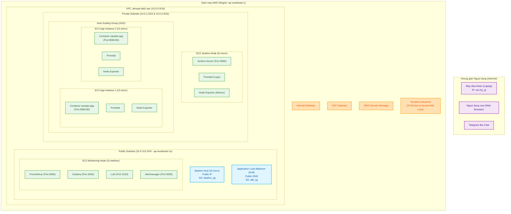

```mermaid
flowchart TB

    classDef public fill:#e1f5fe,stroke:#03a9f4,stroke-width:2px,color:#01579b
    classDef private fill:#efebe9,stroke:#8d6e63,stroke-width:2px,color:#3e2723
    classDef aws fill:#ffe0b2,stroke:#ff9800,stroke-width:2px,color:#e65100
    classDef services fill:#e8f5e9,stroke:#4caf50,stroke-width:2px,color:#1b5e20
    classDef client fill:#f3e5f5,stroke:#9c27b0,stroke-width:2px,color:#4a148c

    %% --- Thuc the ngoai AWS ---
    subgraph ClientSpace ["Khong gian Nguoi dung (Internet)"]
        direction LR
        Admin["May dieu khien (Laptop)<br>IP: var.my_ip"]:::client
        UserBrowser["Nguoi dung cuoi (Web Browser)"]:::client
        TelegramBot["Telegram Bot Chat"]:::client
    end

    subgraph AWS ["Dam may AWS (Region: ap-southeast-1)"]
        direction TB

        IGW["Internet Gateway"]:::aws
        NAT["NAT Gateway"]:::aws
        SecretsManager["AWS Secrets Manager"]:::aws
        S3DB["Terraform Backend<br>(S3 Bucket & DynamoDB Lock)"]:::aws

        subgraph VPC ["VPC: devops-lab2-vpc (10.0.0.0/16)"]

            subgraph PublicSubnet ["Public Subnets (10.0.101.0/24 - ap-southeast-1a)"]
                direction TB
                Bastion["Bastion Host (t2.micro)<br>Public IP<br>SG: bastion_sg"]:::public
                ALB["Application Load Balancer (ALB)<br>Public DNS<br>SG: alb_sg"]:::public

                subgraph MonitoringServer ["EC2 Monitoring Node (t2.medium)"]
                    Prometheus["Prometheus (Port 9090)"]:::services
                    Grafana["Grafana (Port 3000)"]:::services
                    Loki["Loki (Port 3100)"]:::services
                    Alertmgr["Alertmanager (Port 9093)"]:::services
                end
            end

            subgraph PrivateSubnet ["Private Subnets (10.0.1.0/24 & 10.0.2.0/24)"]
                direction TB

                subgraph JenkinsServer ["EC2 Jenkins Node (t2.micro)"]
                    Jenkins["Jenkins Server (Port 8080)"]:::services
                    PromtailJ["Promtail (Logs)"]:::services
                    ExporterJ["Node Exporter (Metrics)"]:::services
                end

                subgraph ASG ["Auto Scaling Group (ASG)"]
                    direction LR
                    subgraph App1 ["EC2 App Instance 1 (t2.micro)"]
                        AppCont1["Container sample-app<br>(Port 8080:80)"]:::services
                        PromtailA1["Promtail"]:::services
                        ExporterA1["Node Exporter"]:::services
                    end

                    subgraph App2 ["EC2 App Instance 2 (t2.micro)"]
                        AppCont2["Container sample-app<br>(Port 8080:80)"]:::services
                        PromtailA2["Promtail"]:::services
                        ExporterA2["Node Exporter"]:::services
                    end
                end
            end
        end
    end
```
