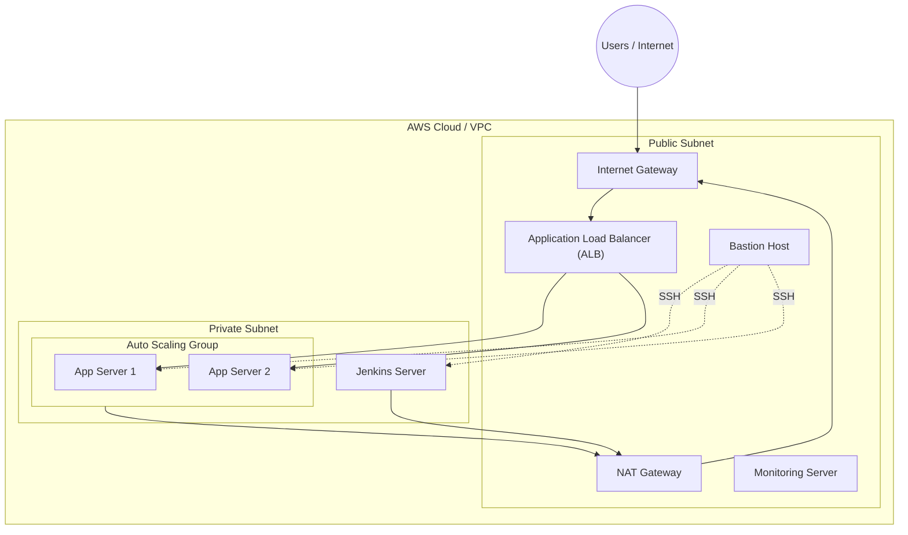

```mermaid
graph TD
    subgraph VPC ["AWS Cloud / VPC"]
        subgraph PublicSubnet ["Public Subnet"]
            IGW["Internet Gateway"]
            ALB["Application Load Balancer (ALB)"]
            NAT["NAT Gateway"]
            Bastion["Bastion Host"]
            Monitor["Monitoring Server"]
        end

        subgraph PrivateSubnet ["Private Subnet"]
            Jenkins["Jenkins Server"]
            subgraph ASG ["Auto Scaling Group"]
                App1["App Server 1"]
                App2["App Server 2"]
            end
        end
    end

    Internet(("Users / Internet")) --> IGW
    IGW --> ALB
    ALB --> App1
    ALB --> App2
    
    Jenkins --> NAT
    ASG --> NAT
    NAT --> IGW

    Bastion -. SSH .-> Jenkins
    Bastion -. SSH .-> App1
    Bastion -. SSH .-> App2
```
